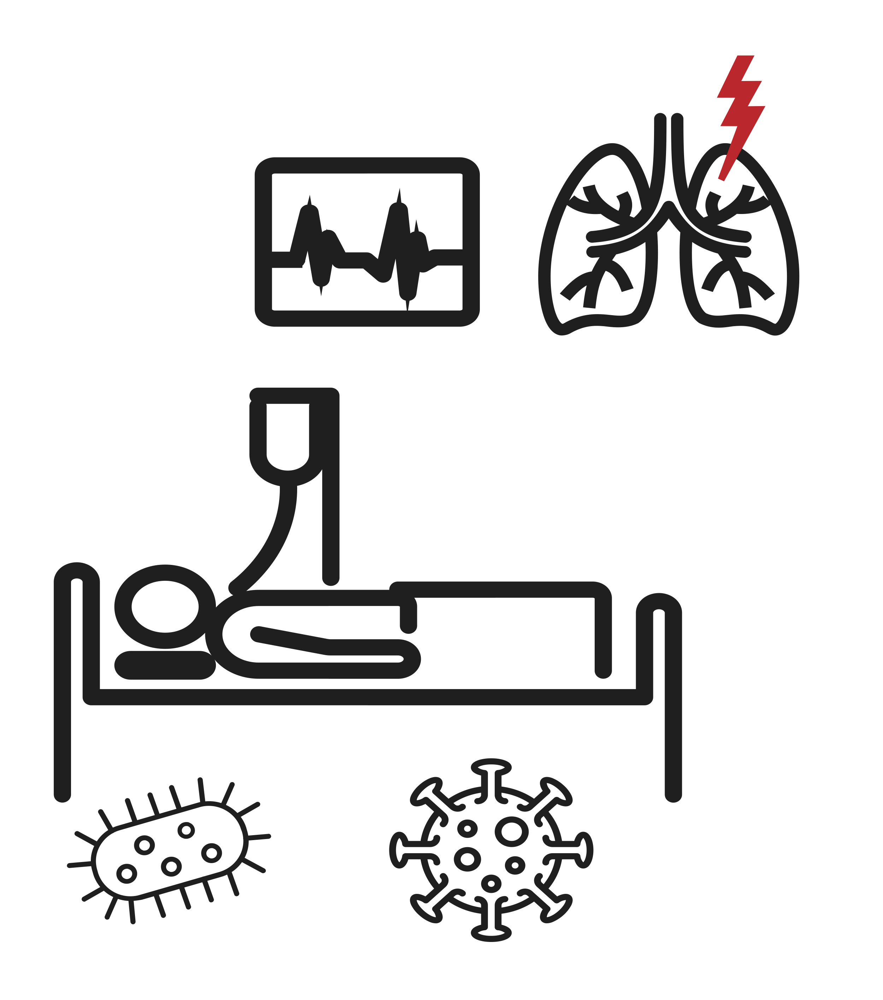

# Multi-omic comparative analysis of COVID-19 and bacterial sepsis-induced ARDS

This repository contains scripts for analysis and figure generation of the paper  **Batra\*, Whalen\* et. al.** Multi-omic comparative analysis of COVID-19 and bacterial sepsis-induced ARDS(2022), *Medrxiv*.

# Content

Execute scripts in order. The code will first compute all result tables and then generate the paper figures. For script 5, a running Cytoscape session is required to generate network files.

Note that Figures 1 and 3 are manually created.

| **Script name**                  | **Description**                                                        |
| :--- | :--- |
| 1_between_analysis.R         | Molecular comparison of the two ARDS groups for all omics layers   |
| 2_within_analysis.R          | Molecular signatures per clinical manifestation in each ARDS group |
| 3_figure2.R                  | Generates Figure 2                                                 |
| 4_figure4a.R                 | Generates Figure 4a                                                |
| 5_figure_4b_5.R              | Generates Figures 4b and 5                                  |
| custom_functions.R           | Internal functions, will be sourced by other scripts               |
| testing_medication_effect.R           | Optional, estimates effect of medication on omics profiles of COVID-19 patients              |
|||
| **Folder**                   | **Description**                                                    |
| input                        | Needs to contain omics and clinical data (see below)               |
| results                      | Will contain output files                                          |
|||                              |                                                                    |
| **Output files in results/** | **Description**                                                    |
| tmp\*                        | Intermediate files used in follow-up scripts                       |
| Figure\*                     | Figure panels                                                      |
| supplementary\*              | Supplementary files                                                |

# Data

The input data used in this manuscript can be obtained from: https://doi.org/10.6084/m9.figshare.19775359

# Reference

    @article{batra_2022,
      author = {Batra Richa, Whalen William, Alvarez-Mulett Sergio, Hoffman Katherine L., Simmons Will, Harrington John, Chetnik Kelsey, Buyukozkan Mustafa, Benedetti Elisa, Choi Mary E., Suhre Karsten, Schmidt Frank, Schenck Edward, Choi  Augustine M.K., Cho Soo Jung, Krumsiek Jan},
      doi = {},
      title = {{Multi-omic comparative analysis of COVID-19 and bacterial sepsis-induced ARDS}},
      url = {},
      year = {2022}
    }
